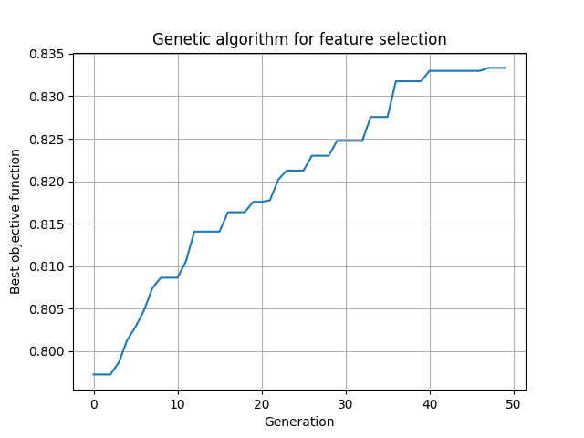

# A Hybrid Model for Image Classification Using Optimal VGG16 Features and XGBoost Classifier

- **Stage 1. Feature Extraction**: Use VGG16 to extract deep image features.
- **Stage 2. Feature Selection**: Apply a Genetic Algorithm (GA) to select the most informative features and reduce redundancy.
- **Stage 3. Classification**: Use XGBoost to classify the selected features.
- **Evaluation**: Evaluate the proposed model on two image datasets in terms of accuracy and computational efficiency.

| The proposed model
| :---: 
| 

---
## 1. VGG16 Image Feature Extraction Pipeline

This repository contains an end-to-end Python pipeline for extracting deep feature representations from medical image datasets (e.g., LC25000) using a pretrained **VGG16 Convolutional Base** combined with **Global Average Pooling (GAP)**.

##  Pipeline Overview

1. **Dataset Ingestion:** Automatically scans directory structures, maps target classes, and indexes image file paths.
2. **Preprocessing:** Resizes images to $224 \times 224$ pixels, converts them to PyTorch Tensors, and applies ImageNet normalization.
3. **Deep Feature Extraction:**
   * Passes inputs through the VGG16 convolutional backbone.
   * Applies `AdaptiveAvgPool2d` to collapse spatial dimensions into a compact $512$-dimensional feature vector per image.
4. **Fault Tolerance:** Catches unreadable or corrupted images during loading without interrupting the batch execution flow.
5. **Persistence:** Exports extracted features, encoded labels, and valid image paths to disk in NumPy format (`.npy`).

##  Requirements & Installation

- [](https://www.python.org/)
[](https://pytorch.org/)
[](https://opensource.org/licenses/MIT)
- **Hardware:** CUDA-compatible GPU recommended for optimal extraction speed.

Install dependencies via `pip`:

```python
pip install torch torchvision numpy pillow opencv-python tqdm
```
---
##  Repository Structure
```text
.
├── features_VGG16.npz            # VGG16 feature extraction
├── VGG16_GV_XGBoost.ipynb        # Jupyter Notebook
├── GA_selected_features_MRI.png  # Number of Selected Features Plot
├── Results                       # Output plots
├── requirements.txt              # Required dependencies
└── README.md                     # Documentation
```
## Dataset Structure

This dataset contains 25,000 histopathological images with 5 classes. All images are 768 x 768 pixels in size and are in jpeg file format. The images were generated from an original sample of HIPAA compliant and validated sources, consisting of 750 total images of lung tissue (250 benign lung tissue, 250 lung adenocarcinomas, and 250 lung squamous cell carcinomas) and 500 total images of colon tissue (250 benign colon tissue and 250 colon adenocarcinomas) and augmented to 25,000 using the Augmentor package. There are five classes in the dataset, each with 5,000 images, being: (kaggle: https://www.kaggle.com/datasets/javaidahmadwani/lc25000)

Links https://arxiv.org/abs/1912.12142v1 https://github.com/tampapath/lung_colon_image_set Dataset BibTeX @article{, title= {LC25000 Lung and colon histopathological image dataset}, keywords= {cancer,histopathology}, author= {Andrew A. Borkowski, Marilyn M. Bui, L. Brannon Thomas, Catherine P. Wilson, Lauren A. DeLand, Stephen M. Mastorides}, url= {https://github.com/tampapath/lung_colon_image_set} }

```text
LC25000/
└── lung_colon_image_set/
    ├── Test Set/
    │   ├── colon_aca/
    │   ├── colon_n/
    │   ├── lung_aca/
    │   ├── lung_n/
    │   └── lung_scc/
    │
    └── Train and Validation Set/
        ├── colon_aca/
        ├── colon_n/
        ├── lung_aca/
        ├── lung_n/
        └── lung_scc/
```

##  Usage Guide

###  Case 1: End-to-End Extraction & GA Selection
Extract 512-dimensional deep feature representations from raw images using the pre-trained VGG16 model and optimize feature subsets via a parallel Genetic Algorithm (GA).

1. **Run Cell 1 (Feature Extraction)**:
   - Traverses the `Train and Validation Set` and `Test Set` directories.
   - Preprocesses images to **224 × 224** and extracts **512-dimensional feature embeddings** using the pre-trained VGG16 model.
   - Automatically saves the extracted features to `features_VGG16.npz` for caching and reuse.
```python
import os
import numpy as np
import torch
import torch.nn as nn
from PIL import Image, UnidentifiedImageError
from torch.utils.data import Dataset, DataLoader
from torchvision import models, transforms
from tqdm import tqdm
import warnings
import time
import cv2
from concurrent.futures import ThreadPoolExecutor
# Start timing
st = time.time()
warnings.filterwarnings("ignore")

class ImageDataset(Dataset):
    def __init__(self, image_paths, labels, label_map):
        self.image_paths = image_paths
        self.labels = labels
        self.label_map = label_map
        self.preprocess = transforms.Compose([
            transforms.Resize((224, 224)),  # VGG16 uses 224x224
            transforms.ToTensor(),
            transforms.Normalize(mean=[0.485, 0.456, 0.406],
                                 std=[0.229, 0.224, 0.225]),
        ])
    def __len__(self):
        return len(self.image_paths)
    def __getitem__(self, idx):
        img_path = self.image_paths[idx]
        label = self.labels[idx]
        try:
            image = Image.open(img_path).convert("RGB")
            image_tensor = self.preprocess(image)
            label_idx = self.label_map[label]
            return image_tensor, label_idx, img_path
        except (UnidentifiedImageError, Exception) as e:
            print(f"Error loading image {img_path}: {e}")
            return torch.zeros(3, 224, 224), -1, img_path  # Dummy for invalid image
def extract_features(image_paths, labels, device=None,
                     batch_size=16, num_workers=4, save_features=False,
                     output_dir='features', label_map=None):
    if device is None:
        device = 'cuda' if torch.cuda.is_available() else 'cpu'
    if len(image_paths) != len(labels):
        raise ValueError("Number of image paths and labels must match.")
    if len(image_paths) == 0:
        print("No images provided.")
        return np.array([]), np.array([]), []
    # Load pretrained VGG16
    model = models.vgg16(pretrained=True)
    model = model.features  # Use only the convolutional base
    model.eval().to(device)
    dataset = ImageDataset(image_paths, labels, label_map=label_map)
    dataloader = DataLoader(dataset, batch_size=batch_size,
                            num_workers=num_workers, shuffle=False,
                            pin_memory=(device != 'cpu'))
    features, extracted_labels, valid_paths = [], [], []
    for batch_tensors, batch_labels, batch_paths in tqdm(dataloader, desc="Extracting features"):
        batch_tensors = batch_tensors.to(device)
        valid_mask = batch_labels != -1
        if valid_mask.sum() == 0:
            continue
        with torch.no_grad():
            # Pass through VGG16 convolutional layers
            conv_feats = model(batch_tensors[valid_mask])
            # Apply global average pooling to get [B, 512]
            batch_feat = torch.nn.functional.adaptive_avg_pool2d(conv_feats, (1, 1)).view(conv_feats.size(0), -1)
            batch_feat = batch_feat.cpu().numpy()
        features.append(batch_feat)
        extracted_labels.extend(batch_labels[valid_mask].cpu().numpy())
        valid_paths.extend([batch_paths[i] for i in range(len(batch_paths)) if valid_mask[i]])
    if not features:
        print("No valid images processed.")
        return np.empty((0, 512)), np.array([]), []
    features = np.concatenate(features, axis=0)
    extracted_labels = np.array(extracted_labels)
    if save_features:
        os.makedirs(output_dir, exist_ok=True)
        np.save(os.path.join(output_dir, 'features.npy'), features)
        np.save(os.path.join(output_dir, 'labels.npy'), extracted_labels)
        with open(os.path.join(output_dir, 'valid_paths.txt'), 'w') as f:
            f.write('\n'.join(valid_paths))
        print(f"Features saved to {output_dir}")
    print(f"Extracted {features.shape[0]} features.")
    return features, extracted_labels, valid_paths
def get_image_paths_and_labels(folder_path):
    image_paths, labels, label_map = [], [], {}
    for idx, label_name in enumerate(sorted(os.listdir(folder_path))):
        label_folder = os.path.join(folder_path, label_name)
        if os.path.isdir(label_folder):
            label_map[label_name] = idx
            for filename in os.listdir(label_folder):
                if filename.lower().endswith(('.png', '.jpg', '.jpeg')):
                    image_paths.append(os.path.join(label_folder, filename))
                    labels.append(label_name)
    return image_paths, labels, label_map
# Folder paths
train_folder = "Train and Validation Set"
test_folder = "Test Set"
# Load image paths and labels
x_train_paths, y_train, train_label_map = get_image_paths_and_labels(train_folder)
x_test_paths, y_test, test_label_map = get_image_paths_and_labels(test_folder)
# Confirm device
device = 'cuda' if torch.cuda.is_available() else 'cpu'
print(f"Using device: {device}")
# Extract test features
print("Extracting features for test set...")
xtest_features, y_test_labels, _ = extract_features(
    x_test_paths, y_test, device=device, batch_size=16,
    num_workers=4, save_features=True,
    output_dir='test_features', label_map=test_label_map)
# Extract train features
print("Extracting features for training set...")
xtrain_features, y_train_labels, _ = extract_features(
    x_train_paths, y_train, device=device, batch_size=16,
    num_workers=4, save_features=True,
    output_dir='train_features', label_map=train_label_map)
# Output shapes
print(f"Train features shape: {xtrain_features.shape}")
print(f"Train labels shape: {y_train_labels.shape}")
print(f"Test features shape: {xtest_features.shape}")
print(f"Test labels shape: {y_test_labels.shape}")
# End timing
end = time.time()
print(f"Total execution time: {end - st:.2f} seconds")
```
2. **Run Cell 2: GA (Parallel) without K-Fold Cross-Validation**:
   - Selects the optimal subset of extracted features using parallel fitness evaluations with K-Fold Cross-Validation.
   - Fits a Logistic Regression classifier on the selected training features.
```python
import random
import time
import matplotlib.pyplot as plt
import numpy as np
import torch
from sklearn.linear_model import LogisticRegression
from sklearn.metrics import accuracy_score
from sklearn.model_selection import train_test_split

start_time = time.time()

# ---------------------------------------------------------
# 1. Data Preparation & Device Setup
# ---------------------------------------------------------
X_tr, X_val, y_tr, y_val = train_test_split(
    xtrain_features,
    y_train_labels,
    test_size=0.2,
    random_state=42,
    stratify=y_train_labels,
)

# Convert split data to PyTorch Tensors
X_tr_t = torch.tensor(X_tr, dtype=torch.float32)
y_tr_t = torch.tensor(y_tr, dtype=torch.float32)
X_val_t = torch.tensor(X_val, dtype=torch.float32)
y_val_t = torch.tensor(y_val, dtype=torch.float32)

# Multi-GPU setup (default to CUDA:0 or CPU if unavailable)
device_count = torch.cuda.device_count()
devices = [torch.device(f"cuda:{i}") for i in range(device_count)] if device_count > 0 else [torch.device("cpu")]
print(f"Running on {len(devices)} device(s): {devices}")


# ---------------------------------------------------------
# 2. Fast GPU Batch Evaluation (Ridge Closed-Form Solution)
# ---------------------------------------------------------
def evaluate_batch_gpu(population_subset, device, X_tr_t, y_tr_t, X_val_t, y_val_t):
    """Evaluates a subset of GA individuals on a specified GPU/CPU device."""
    X_tr_d, y_tr_d = X_tr_t.to(device), y_tr_t.to(device).unsqueeze(1)
    X_val_d, y_val_d = X_val_t.to(device), y_val_t.to(device)

    scores = []
    for ind in population_subset:
        selected = torch.tensor(ind, dtype=torch.bool, device=device)
        if not selected.any():
            scores.append(0.0)
            continue

        # Extract selected features and add bias column
        X_tr_sub = torch.cat([torch.ones((X_tr_d.shape[0], 1), device=device), X_tr_d[:, selected]], dim=1)
        X_val_sub = torch.cat([torch.ones((X_val_d.shape[0], 1), device=device), X_val_d[:, selected]], dim=1)

        # Closed-form Ridge Classifier solution: W = (X^T * X + lambda * I)^(-1) * X^T * Y
        reg = 1e-4 * torch.eye(X_tr_sub.shape[1], device=device)
        weights = torch.linalg.pinv(X_tr_sub.T @ X_tr_sub + reg) @ X_tr_sub.T @ (y_tr_d * 2 - 1)

        # Predict and evaluate accuracy on validation set
        preds = (X_val_sub @ weights) > 0
        acc = (preds.squeeze() == y_val_d).float().mean().item()
        scores.append(acc)

    return scores


# ---------------------------------------------------------
# 3. Genetic Algorithm Core Function
# ---------------------------------------------------------
def genetic_algorithm(pop_size=50, generations=200, mutation_rate=0.01):
    n_features = X_tr.shape[1]
    population = [np.random.randint(0, 2, n_features).astype(bool) for _ in range(pop_size)]

    best_history, avg_history, feature_count_history = [], [], []
    best_ind_overall, best_fit_overall = None, -1.0

    for gen in range(generations):
        # Parallel evaluation across available devices
        split_size = pop_size // len(devices)
        scores = []
        for i, dev in enumerate(devices):
            sub_pop = population[i * split_size :] if i == len(devices) - 1 else population[i * split_size : (i + 1) * split_size]
            scores.extend(evaluate_batch_gpu(sub_pop, dev, X_tr_t, y_tr_t, X_val_t, y_val_t))

        scores = np.array(scores)
        best_idx = np.argmax(scores)
        best_score, avg_score = scores[best_idx], np.mean(scores)
        best_ind = population[best_idx].copy()

        # Track history metrics
        best_history.append(best_score)
        avg_history.append(avg_score)
        feature_count_history.append(np.sum(best_ind))

        if best_score > best_fit_overall:
            best_fit_overall = best_score
            best_ind_overall = best_ind.copy()

        print(f"Gen {gen+1:03d} | Best Fitness: {best_score:.4f} | Avg Fitness: {avg_score:.4f} | Features: {np.sum(best_ind)}")

        # Selection: Retain top 50% parents
        sorted_indices = np.argsort(scores)[::-1]
        population = [population[idx] for idx in sorted_indices[: pop_size // 2]]

        # Crossover & Vectorized Mutation to refill population
        while len(population) < pop_size:
            p1, p2 = random.sample(population, 2)
            cp = random.randint(1, n_features - 1)
            child = np.concatenate([p1[:cp], p2[cp:]])
            
            # Fast numpy mutation
            mutation_mask = np.random.rand(n_features) < mutation_rate
            child[mutation_mask] = ~child[mutation_mask]
            population.append(child)

    return best_ind_overall, best_fit_overall, best_history, avg_history, feature_count_history


# ---------------------------------------------------------
# 4. Execution & Model Evaluation
# ---------------------------------------------------------
print("\n--- STARTING PARALLEL GENETIC ALGORITHM ---")
best_ind, best_fit, best_hist, avg_hist, feat_hist = genetic_algorithm(pop_size=50, generations=200)

# Final validation on Test Set using Scikit-Learn Logistic Regression
clf = LogisticRegression(max_iter=1000)
clf.fit(xtrain_features[:, best_ind], y_train_labels)
test_acc = accuracy_score(y_test_labels, clf.predict(xtest_features[:, best_ind]))

print("\n--- FINAL RESULTS ---")
print(f"Best Validation Accuracy (GA): {best_fit:.4f}")
print(f"Final Test Accuracy:          {test_acc:.4f}")
print(f"Selected Features Count:      {np.sum(best_ind)} / {X_tr.shape[1]}")
print(f"Total Execution Time:         {time.time() - start_time:.2f} seconds")


# ---------------------------------------------------------
# 5. Visualizations
# ---------------------------------------------------------
gen_range = range(1, len(best_hist) + 1)

# Plot 1: Convergence Curve
plt.figure(figsize=(8, 5))
plt.plot(gen_range, best_hist, linewidth=2, label="Best Objective Value")
plt.plot(gen_range, avg_hist, linewidth=2, linestyle="--", label="Average Objective Value")
plt.title("GA Convergence Curve")
plt.xlabel("Generation")
plt.ylabel("Accuracy Score")
plt.legend()
plt.grid(True)
plt.tight_layout()
plt.savefig("GA_convergence_curve_MRI.png", dpi=300, bbox_inches="tight")
plt.show()

# Plot 2: Selected Features Trend
plt.figure(figsize=(8, 5))
plt.plot(gen_range, feat_hist, color="green", linewidth=2)
plt.title("Selected Features per Generation")
plt.xlabel("Generation")
plt.ylabel("Number of Features")
plt.grid(True)
plt.tight_layout()
plt.savefig("GA_selected_features_MRI.png", dpi=300, bbox_inches="tight")
plt.show()
```


